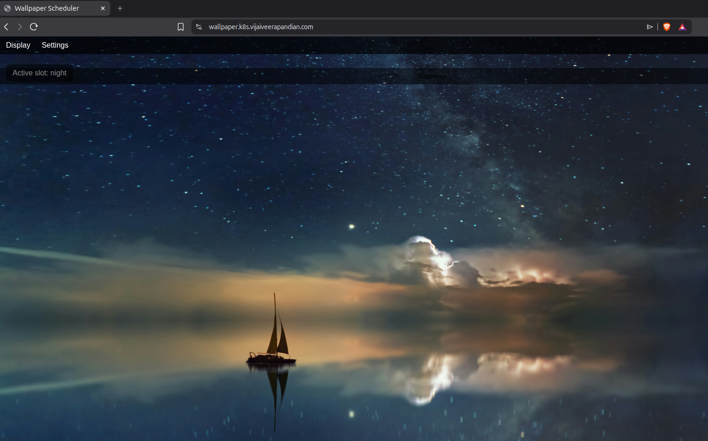

# wallpaper-app

[](https://github.com/vijai-veerapandian/wallpaper-app/actions/workflows/ci.yml)

A small Flask application that rotates desktop wallpapers based on the time of day.
Four slots — morning, afternoon, evening, night — each with its own image set and rotation
interval, editable from the browser.

Built as the reference workload for an on-premises Kubernetes cluster, so it doubles as a
worked example of a DevSecOps pipeline: scanned, signed, and deployed by GitOps.

URL: https://wallpaper.k8s.vijaiveerapandian.com



---

## What it does

| Route | Purpose |
|---|---|
| `/` | Full-screen wallpaper display for the active slot |
| `/settings` | Edit slot times, rotation interval and image lists |
| `/api/current` | JSON: active slot and its wallpapers |
| `/health` | Liveness/readiness probe |

The schedule lives in `config/schedule.json`. The active slot is chosen from the current
time, and the browser cycles its images at the configured interval.

## Run locally

```bash
pip install -r requirements-dev.txt
python run.py            # http://localhost:5000
```

Tests and checks:

```bash
pytest -v --cov=app
flake8 app tests && black --check app tests
```

## Run with Docker

```bash
docker build -t wallpaper-app .
docker run --rm -p 5000:5000 -e SECRET_KEY="$(openssl rand -hex 32)" wallpaper-app
```

Two-stage build on `python:3.12-slim`. The runtime stage gets only a virtualenv and the
application — no pip, no build tooling — and runs as UID 1000.

`SECRET_KEY` signs CSRF tokens. It must be stable across restarts and identical across
gunicorn workers, so it comes from the environment rather than being generated per process.

## Deploy to Kubernetes

Manifests are in [`deploy/`](deploy/) (kustomize): Deployment, Service, HTTPRoute and a PVC
for the writable schedule file.

Deployed by Argo CD from a separate cluster repository —
[onpremk8s](https://github.com/vijai-veerapandian/onpremk8s) — which holds only the
`Application` manifest pointing back here. A deploy is a commit: bump `newTag` in
`deploy/kustomization.yaml` to a published `sha-` tag and push.

Runs as a single replica with `strategy: Recreate`, because the schedule is file-backed on
a ReadWriteOnce volume — two replicas would each hold a private copy and disagree.

## CI/CD

Three stages. **Nothing is published until every scan passes.**

| Stage | Checks |
|---|---|
| `quality` | flake8, black, pytest with coverage |
| `security` | gitleaks, CodeQL, bandit, pip-audit |
| `build` | hadolint, Trivy (image + manifests), OWASP ZAP DAST, cosign signing |

`build` depends on the other two. Inside it the image is built **locally**, scanned
statically and dynamically, and only then pushed to GHCR and signed — so an unscanned
image never reaches the registry.

Images are published to `ghcr.io/vijai-veerapandian/wallpaper-app` with an immutable
`sha-<short>` tag, an SBOM, a provenance attestation, and a keyless cosign signature.

```bash
cosign verify ghcr.io/vijai-veerapandian/wallpaper-app:latest \
  --certificate-identity-regexp 'https://github.com/vijai-veerapandian/wallpaper-app/.*' \
  --certificate-oidc-issuer https://token.actions.githubusercontent.com
```

## Security

Findings the pipeline caught, and the fixes:

- **CSRF** — ZAP found `POST /settings` unprotected. Now uses Flask-WTF `CSRFProtect`.
- **Security headers** — CSP, `X-Frame-Options`, `X-Content-Type-Options`,
  `Referrer-Policy`, `Permissions-Policy`, set in one `after_request` hook. The CSP needs
  no `unsafe-inline`: page data is passed via `data-` attributes rather than an inline
  `<script>`.
- **Container user** — hadolint flagged a non-numeric `USER`, which stops the kubelet
  verifying `runAsNonRoot`. Now `USER 1000:1000`.
- **Dependencies** — pip-audit found two Flask advisories; bumped to 3.1.3.

The pod runs non-root with a read-only root filesystem, all capabilities dropped and
`seccompProfile: RuntimeDefault` — compliant with Pod Security Admission `restricted`.

## Layout

```
app/          Flask application (routes, services, templates, static)
config/       default schedule.json
tests/        pytest suite
deploy/       Kubernetes manifests (kustomize)
docs/images/  screenshots — wallpaper-app-ui.png is the hero image above
Dockerfile    two-stage, non-root
```

Screenshots are linked directly from this README, so keep filenames stable and images
reasonably small (PNG, under a few hundred KB).

## License

MIT — see [LICENSE](LICENSE).
